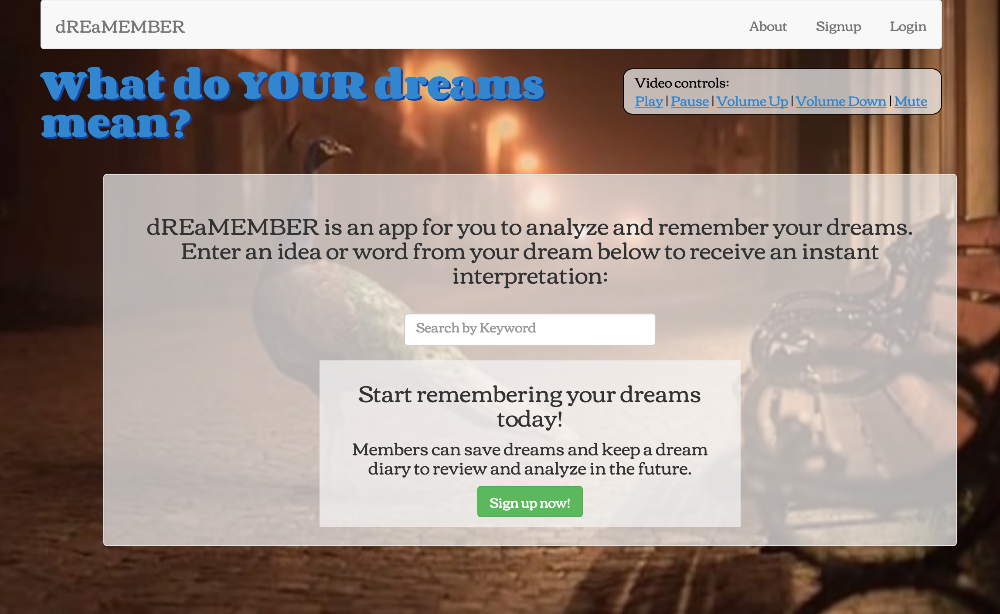

<h1>dREaMEMBER</h1>

<a href="https://dreamember.herokuapp.com/" target="_blank">https://dreamember.herokuapp.com/</a>

<h3>About</h3>

 dREaMEMBER is a dream analysis and journaling app. Users enter words and receive dream interpretations based upon definitions from the <a href="http://www.dreammoods.com/">Dream Moods Dictionary</a>. Members can record and review dream dates, main themes and descriptions.  

<h3>Technologies Used</h3>

<ul>
  <li>Express.js</li>
  <li>AngularJS</li>
  <li>Node.js</li>
  <li>Mongoose for MongoDB</li>
  <li>JQuery</li>
  <li>Tubular.js</li>
  <li>Bcrypt</li>
  <li>HTML5</li>
  <li>CSS3</li>
  <li>Bootstrap</li>
  <li>Google Fonts</li>
</ul>

<h3>Installation</h3>

<ul>
  <li><code>npm install</code> in the terminal</li>
  <li>Node modules included: bcrypt, body-parser, express, express-jwt, jsonwebtoken, mongoose</li>
</ul>

<h3>Approach Taken</h3>
<h2>

  Prior to any site design, I began with potential user stories:
  <ul>
    <li>I dreamed that I was flying and I want to find out what that means.</li> 
    <li>I had a confusing dream and I’m curious to know if the images are predicting something in my life.</li>
    <li>I forget my dreams quickly and I want an easy place to write down notes when I wake up, so I can remember them.</li>
    <li>I want to be able to keep track of when and what I dreamed over time.</li>
  </ul>

  With these ideas in mind, I used the <a href="https://balsamiq.com/">Balsalmic</a> wireframing tool, to create several site pages mockups. The wireframes are viewable <a href="https://github.com/bethburger42/dreamember/tree/master/wireframes">HERE</a>.

  My first step was to build the site user authentication for signing up and logging into the website. I then built the functionality for recording and displaying dreams. Once these models were working correctly, I tied the users and dreams together in the database, which would allowed users to create and display all of their individual dreams. During the development of the member area, I built out the pages using the bootstrap framework for consistent design. When the member area was complete, I turned my focus to the dream analyis portion of the website. I initially did some data scraping, then decided to create the functionality for entering words and definitions via the site. For increased visual appeal, I installed the TubularJS video player to integrate a streaming background image for the website.

<h3>Known Issues</h3>
<h2>
<ul>
  <li>The TubularJS video player works in Internet Explorer and Safari but loads sporadically in Chrome.</li>
  <li>The functionality for updating a Dream object has been removed temporarily, as it was working incorrectly.</li>
</ul>

